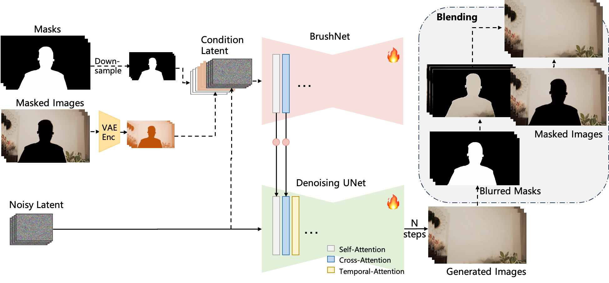

<div align="center">

<h1>DiffuEraser: A Diffusion Model for Video Inpainting</h1>

<div>
    Xiaowen Li&emsp;
    Haolan Xue&emsp;
    Peiran Ren&emsp;
    Liefeng Bo
</div>
<div>
    Tongyi Lab, Alibaba Group&emsp; 
</div>

<div>
    <strong>TECHNICAL REPORT</strong>
</div>

<div>
    <h4 align="center">
        <a href="https://lixiaowen-xw.github.io/DiffuEraser-page" target='_blank'>
        
        </a>
        <a href="https://arxiv.org/abs/2501.10018" target='_blank'>
        
        </a>
    </h4>
</div>


</div>

DiffuEraser is a diffusion model for video inpainting, which outperforms state-of-the-art model Propainter in both content completeness and temporal consistency while maintaining acceptable efficiency.

---


## Update Log
- *2025.01.20*: Release inference code.


## TODO
- [ ] Release training code.
- [ ] Release HuggingFace/ModelScope demo.
- [ ] Release gradio demo.
  
  
## Results
More results will be displayed on the project page.   

https://github.com/user-attachments/assets/b59d0b88-4186-4531-8698-adf6e62058f8


## Method Overview
Our network is inspired by [BrushNet](https://github.com/TencentARC/BrushNet) and [Animatediff](https://github.com/guoyww/AnimateDiff). The architecture comprises the primary `denoising UNet` and an auxiliary `BrushNet branch`. Features extracted by BrushNet branch are integrated into the denoising UNet layer by layer after a zero convolution block. The denoising UNet performs the denoising process to generate the final output. To enhance temporal consistency, `temporal attention` mechanisms are incorporated following both self-attention and cross-attention layers. After denoising, the generated images are blended with the input masked images using blurred masks.



We incorporate `prior` information to provide initialization and weak conditioning, which helps mitigate noisy artifacts and suppress hallucinations.
Additionally, to improve temporal consistency during long-sequence inference, we expand the `temporal receptive fields` of both the prior model and DiffuEraser, and further enhance consistency by leveraging the temporal smoothing capabilities of Video Diffusion Models. Please read the paper for details.


## Getting Started

#### Installation 

1. Clone Repo

   ```bash
   git clone https://github.com/lixiaowen-xw/DiffuEraser.git
   ```

2. Create Conda Environment and Install Dependencies

   ```bash
   # create new anaconda env
   conda create -n diffueraser python=3.9.19  
   conda activate diffueraser
   # install python dependencies
   pip install -r requirements.txt 
   ```

#### Prepare pretrained models
Weights will be placed under the `./weights` directory.  
1. Download our pretrained models from [Hugging Face](https://huggingface.co/lixiaowen/diffuEraser) or [ModelScope](https://www.modelscope.cn/xingzi/diffuEraser.git) to the `weights` folder.  
2. Download pretrained weight of based models and other components:  
    - [stable-diffusion-v1-5](https://huggingface.co/stable-diffusion-v1-5/stable-diffusion-v1-5)  
    - [PCM_Weights](https://huggingface.co/wangfuyun/PCM_Weights)  
    - [propainter](https://github.com/sczhou/ProPainter/releases/tag/v0.1.0)  
    - [sd-vae-ft-mse](https://huggingface.co/stabilityai/sd-vae-ft-mse) 


The directory structure will be arranged as:
```
weights
   |- diffuEraser
      |-brushnet
      |-unet_main
   |- stable-diffusion-v1-5
      |-feature_extractor
      |-...
   |- PCM_Weights
      |-sd15
   |- propainter
      |-ProPainter.pth
      |-raft-things.pth
      |-recurrent_flow_completion.pth
   |- sd-vae-ft-mse
      |-diffusion_pytorch_model.bin
      |-...
   |- README.md
```

#### Main Inference
We provide some examples in the [`examples`](./examples) folder.
Run the following commands to try it out:
```shell
cd DiffuEraser
python run_diffueraser.py 
```
The results will be saved in the `results` folder.
To test your own videos, please replace the `input_video` and `input_mask` in run_diffueraser.py .  The first inference may take a long time.  

The `frame rate` of input_video and input_mask needs to be consistent.  We currently only support `mp4 video`  as input intead of split frames, you can convert frames to video using ffmepg:
```shell
ffmpeg -i image%03d.jpg -c:v libx264 -r 25 output.mp4
```
Notice: Do not convert the frame rate of mask video if it is not consitent with that of the input video, which would lead to errors due to misalignment. 


Blow shows the estimated GPU memory requirements and inference time for different resolution: 

| Resolution | Gpu Memeory | Inference Time(250f(~10s), L20) |
| :--------- | :---------: | :-----------------------------: |
| 1280 x 720 |     33G     |              314s               |
| 960 x 540  |     20G     |              175s               |
| 640 x 360  |     12G     |               92s               |
 

## Citation

   If you find our repo useful for your research, please consider citing our paper:

   ```bibtex
   @misc{li2025diffueraserdiffusionmodelvideo,
      title={DiffuEraser: A Diffusion Model for Video Inpainting}, 
      author={Xiaowen Li and Haolan Xue and Peiran Ren and Liefeng Bo},
      year={2025},
      eprint={2501.10018},
      archivePrefix={arXiv},
      primaryClass={cs.CV},
      url={https://arxiv.org/abs/2501.10018}, 
}
   ```


## License
This repository uses [Propainter](https://github.com/sczhou/ProPainter) as the prior model. Users must comply with [Propainter's license](https://github.com/sczhou/ProPainter/blob/main/LICENSE) when using this code. Or you can use other model to replace it.

This project is licensed under the [Apache License Version 2.0](./LICENSE) except for the third-party components listed below.


## Acknowledgement

This code is based on [BrushNet](https://github.com/TencentARC/BrushNet), [Propainter](https://github.com/sczhou/ProPainter) and [Animatediff](https://github.com/guoyww/AnimateDiff). The example videos come from [Pexels](https://www.pexels.com/), [DAVIS](https://davischallenge.org/), [SA-V](https://ai.meta.com/datasets/segment-anything-video) and [DanceTrack](https://dancetrack.github.io/).  Thanks for their awesome works.   


